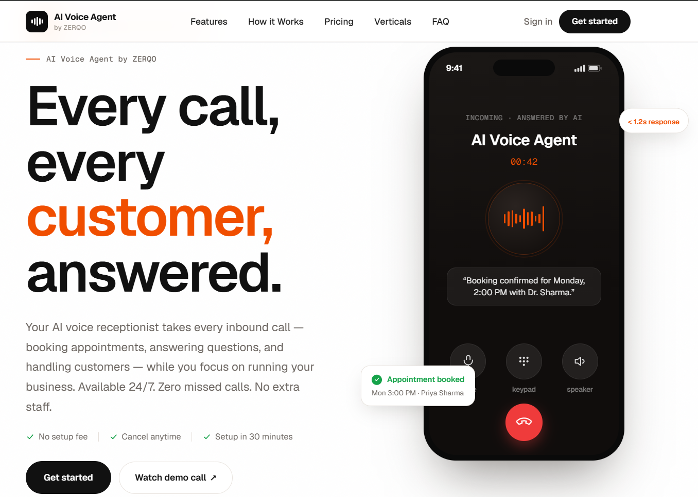
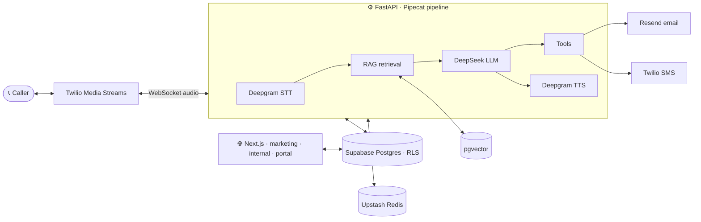

<div align="center">

# 🎙️ ZERQO — AI Voice Agent

### _Every call, every customer, answered._

An AI voice receptionist that takes every inbound phone call — **booking appointments, answering questions from your own documents, and handling customers 24/7**. Multi-tenant, multi-vertical, and built for Indian SMBs.

[](https://github.com/Shubhamraj8/ai-voice/actions/workflows/ci.yml)
&nbsp;
&nbsp;

<br/>


</div>

---

## 📸 A look inside

<p align="center">
  
</p>

<p align="center"><em>The AI receptionist answers in under 1.2s, books appointments, and hands off to a human when needed.</em></p>

<br/>

<p align="center">
  
</p>

<p align="center"><em>Simple, paid-only plans — no setup fees, cancel anytime.</em></p>

---

## ✨ What is ZERQO?

ZERQO answers a business's phone with a natural-sounding AI agent. A caller dials the business number, and within a second the agent picks up, greets them, understands what they need, **answers from the business's own knowledge base**, and takes real actions — transferring to a human, texting a link, or flagging the owner — all while the call is recorded, transcribed, summarised, and costed automatically.

One generic agent design serves **clinics, restaurants, hotels, retail, and any inbound use case** — behaviour comes from the system prompt, the uploaded knowledge, and the tool whitelist, not from separate code paths. Every speech, language, and telephony provider sits behind a clean abstraction, so a new market is a configuration change, not a rewrite.

- 🌐 **Multi-tenant** — every business is isolated at the database level via Postgres Row-Level Security.
- 🧠 **Knows your business** — upload PDFs; the agent answers grounded in your content (RAG), or says it doesn't know.
- 🔌 **Provider-agnostic** — STT, TTS, LLM, and embeddings swap behind protocol interfaces (DeepSeek **or Gemini** for the LLM; OpenAI **or Gemini** for embeddings).
- ⚡ **Fast** — sub-1.2s per-turn latency target, sub-800ms greeting on pickup.

---

## 🧩 Features

### 📞 Real-time voice pipeline

- Inbound calls over **Twilio Media Streams** (bidirectional WebSocket audio).
- **Deepgram Nova-3** STT → **DeepSeek V4 Flash** (or **Google Gemini**) LLM → **Deepgram Aura** TTS, orchestrated by **Pipecat** inside FastAPI.
- VAD-based **turn detection with barge-in**, a static sub-800ms greeting, and a recorded-call consent disclosure on pickup.
- Per-call + per-turn persistence, latency metrics, call recording to Supabase Storage, and agent-process lifecycle management.

### 🧠 Business brain (RAG)

- PDF ingestion: extract → chunk (tiktoken) → embed (**OpenAI `text-embedding-3-small`** or **Gemini `gemini-embedding-001`**, 1536-dim) → store in **pgvector**.
- Per-turn retrieval injects the most relevant chunks into the LLM context; the agent answers from them or gracefully says it can't.
- Query embeddings cached in Redis; tenant-isolated retrieval (one tenant never sees another's content).

### 🛠️ Tools the agent can call

- **`transferToHuman`** — warm-transfer the live call to a configured human number.
- **`sendSms`** — text the caller a link, address, or confirmation (Twilio Messaging).
- **`escalateToOwner`** — notify the owner (email via Resend and/or SMS) about a call that needs attention.
- A typed tool framework (Pydantic schemas), **per-agent whitelisting**, **per-call rate limits**, and **idempotency keys** so retries never double-fire side effects.

### 📊 After every call

- **Summary + intent + outcome** generated by DeepSeek (JSON mode), written back to the call.
- **Per-call cost** broken down into STT / TTS / LLM / telephony for true COGS visibility.

### 🖥️ Internal dashboard

- Tenant provisioning, agent configuration, voice selection, prompt editing, and a **knowledge browser** (drag-and-drop upload, live status, sample-chunk preview, reprocess, delete).
- Call review, global metrics, and a full **audit log**.

### 👤 Client portal (read-only)

- Tenants sign in to see their dashboard, call logs, call detail (transcript + audio), and billing/usage.

### 🤝 Onboarding & billing _(sales-led, paid-only)_

- Landing-page CTAs open a **lead-capture dialog** → the team is notified by email.
- The team agrees a plan and takes payment, then provisions the tenant and issues a login valid for the paid period (`paid_until`); access pauses automatically when it lapses.
- **No free trial and no self-serve checkout** in v1 — a payment gateway (Razorpay / Cashfree) is planned for a later release.

### 🔒 Compliance & observability

- DPDP-style data **export + delete**, consent disclosure, and 30-day recording retention.
- **Sentry** error tracking with PII scrubbing across frontend and backend.

---

## 🏗️ Architecture



**Per-turn flow:** caller speaks → STT transcribes → the latest utterance is embedded and matched against the tenant's vectors → relevant chunks are injected → DeepSeek responds (and may call a tool) → Aura speaks the reply → the turn is logged with latency + retrieval metrics.

---

## 🛠️ Tech stack

| Layer              | Choice                                                                          |
| ------------------ | ------------------------------------------------------------------------------- |
| **Frontend**       | Next.js 14 (App Router), TypeScript, Tailwind, shadcn/ui                        |
| **Backend**        | Python 3.11, FastAPI, Pydantic v2, APScheduler                                  |
| **Voice**          | Pipecat (self-hosted), Twilio Media Streams                                     |
| **Speech**         | Deepgram Nova-3 (STT) + Aura-1 (TTS)                                            |
| **LLM**            | DeepSeek V4 Flash (default) or **Google Gemini** — swappable                    |
| **Embeddings**     | OpenAI `text-embedding-3-small` or **Gemini** `gemini-embedding-001` (1536-dim) |
| **Data**           | Supabase Postgres 15, pgvector, Supabase Auth + Storage                         |
| **Cache / limits** | Upstash Redis (REST)                                                            |
| **Email**          | Resend                                                                          |
| **Observability**  | Sentry, structlog, PostHog                                                      |
| **Infra**          | Vercel (web), Render (api), GitHub Actions CI                                   |

> **Provider flexibility — run it on one free key.** The LLM and embedding providers
> are env-swappable. Set `LLM_PROVIDER=gemini` + `EMBEDDING_PROVIDER=gemini` and a
> single **Google Gemini** key powers both the conversational LLM _and_ the RAG
> embeddings (output 1536-dim to match the pgvector column) — **no DeepSeek or
> OpenAI key required**. Ideal for local dev/testing on Gemini's free tier, or as a
> drop-in fallback when the default providers aren't configured.

---

## 📦 Monorepo

```text
/apps
  /web                # Next.js 14 — marketing site, client portal, internal dashboard
  /api                # FastAPI — Twilio webhooks, Pipecat pipeline, internal API, jobs
/packages
  /db                 # Postgres migrations + DB tooling
  /shared             # Shared TypeScript types and Zod schemas
/docs                 # product + architecture docs
```

---

## 🚀 Getting started

**Prerequisites:** Node.js 20+, pnpm 9+, Python 3.11+

```bash
pnpm install
pnpm --filter @ai-voice/api run install:python
cp .env.example .env          # add your Supabase + provider credentials
pnpm --filter @ai-voice/db run migrate:up
```

> See [`packages/db/README.md`](packages/db/README.md) for Supabase project setup. Or run `pnpm setup` for the combined script.

### Run both apps

```bash
pnpm dev
```

- 🌐 **Web** → http://localhost:3000 — marketing site, client portal, internal dashboard
- 🔌 **API** → http://localhost:8000 — Twilio voice webhooks + internal endpoints

### Twilio dev tunnel

Twilio webhooks need a public URL. Expose the local API with ngrok:

```powershell
.\scripts\dev-with-tunnel.ps1   # loads .env, starts ngrok + pnpm dev, prints the webhook URL
```

Paste the printed URL into the Twilio Console → _Phone Numbers → Active Numbers → Voice URL_:
`https://<your-id>.ngrok-free.app/webhooks/twilio/voice` (HTTP POST). Set `TWILIO_AUTO_UPDATE_WEBHOOK=true` to update it automatically on each start.

---

## ✅ Quality checks

```bash
pnpm validate          # lint + typecheck + format:check (all packages)
pnpm test:rls          # cross-tenant RLS smoke test (after migration 006 + .env)
```

A Husky pre-commit hook runs `lint-staged` + `typecheck` on every commit; CI runs the full suite on every PR.

---

## 💳 Plans

Sales-led and **paid-only** — pricing is informational; the team onboards you after a quick conversation.

| Plan        | Monthly | Included     | Numbers |
| ----------- | ------- | ------------ | ------- |
| **Starter** | ₹2,999  | 300 min/mo   | 1       |
| **Growth**  | ₹6,999  | 800 min/mo   | 1       |
| **Pro**     | ₹16,999 | 2,000 min/mo | 2       |

---

## 📚 Documentation

| Doc                                            | What's inside                          |
| ---------------------------------------------- | -------------------------------------- |
| [`docs/design.md`](docs/design.md)             | System architecture + technical design |
| [`docs/features.md`](docs/features.md)         | Full feature inventory across versions |
| [`docs/mvp-planning.md`](docs/mvp-planning.md) | Week-by-week execution plan            |
| [`docs/roadmap.md`](docs/roadmap.md)           | Longer-term product roadmap            |
| [`docs/tickets.md`](docs/tickets.md)           | Implementation tickets                 |
| [`CONTRIBUTING.md`](CONTRIBUTING.md)           | Contribution guide                     |

<div align="center">

<br/>

**ZERQO** — _every call, every customer, answered._ 🎙️

</div>
