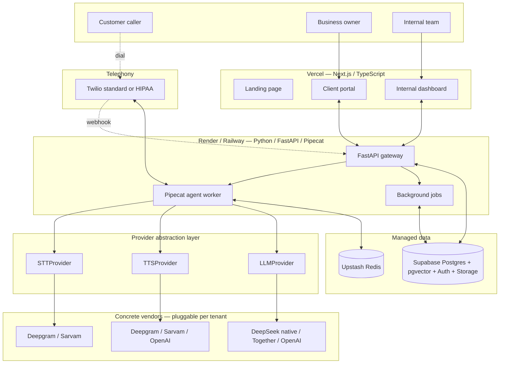
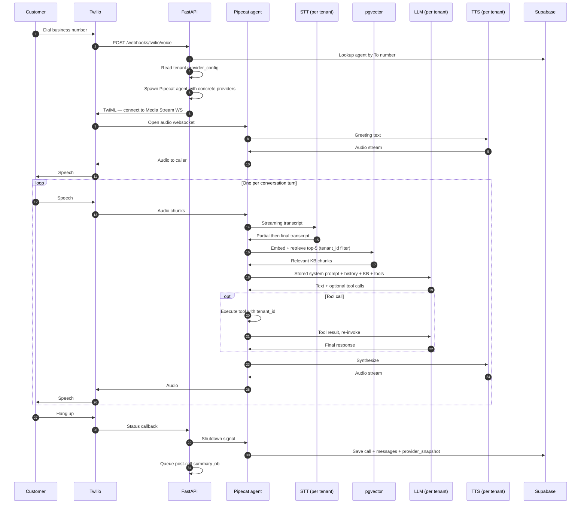
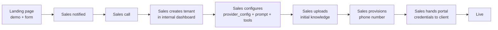
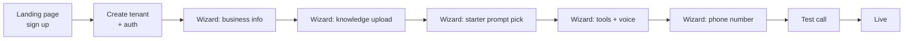

# Voice AI micro-SaaS — system design

> Multi-vertical, multi-market AI voice agent platform. Built so STT, TTS, and LLM swap per tenant via configuration — same code serves an English clinic in Delhi, a Hindi-speaking restaurant in Jaipur, and a HIPAA-eligible dental practice in Austin. One generic agent design, two onboarding paths, four target markets, shipped one at a time.

|                     |                                         |
| ------------------- | --------------------------------------- |
| Version             | 1.2 (Deepgram-standardized voice stack) |
| Status              | Pre-implementation                      |
| Phase 1 ship target | India English market, generic agent     |
| Owner               | Founder + small team                    |

---

## Contents

1. [Goals and shipping plan](#1-goals-and-shipping-plan)
2. [Architecture at a glance](#2-architecture-at-a-glance)
3. [Tech stack and rationale](#3-tech-stack-and-rationale)
4. [Provider abstraction layer](#4-provider-abstraction-layer)
5. [Deployment topology](#5-deployment-topology)
6. [Multi-tenancy strategy](#6-multi-tenancy-strategy)
7. [Data model](#7-data-model)
8. [Business brain — the three sublayers](#8-business-brain--the-three-sublayers)
9. [Workflow engine — one generic, customizable](#9-workflow-engine--one-generic-customizable)
10. [Call lifecycle](#10-call-lifecycle)
11. [Dual-path onboarding](#11-dual-path-onboarding)
12. [Cost model — three tiers](#12-cost-model--three-tiers)
13. [Compliance and privacy](#13-compliance-and-privacy)
14. [Observability and quality](#14-observability-and-quality)
15. [Scaling triggers](#15-scaling-triggers)
16. [Shipping order and open decisions](#16-shipping-order-and-open-decisions)
17. [Glossary](#17-glossary)

---

## 1. Goals and shipping plan

### Architectural goals (true from day one)

- Multi-market by configuration, not code: the same backend serves English, Hindi, and HIPAA-eligible tenants by swapping provider implementations.
- One generic agent design that fits clinics, restaurants, hotels, marts, and any other inbound voice use case. No vertical forks.
- Two onboarding doors (sales-led and self-serve) backed by the same APIs and tables.
- Multi-tenant from day one with database-enforced isolation.
- Variable cost per minute kept tight: target ~2.5¢/min for India English, sub-5¢/min for US HIPAA. Margins protected by per-minute concise-response discipline and per-tenant overage billing.

### What ships in v1 (months 1–3)

- One market wired: **India English** with the Deepgram voice stack (Deepgram Nova-3 Monolingual + Deepgram Aura-1 + DeepSeek V4 Flash native).
- One agent type: generic, configurable system prompt and tool whitelist.
- Five **starter prompts** at onboarding (receptionist, restaurant, hotel, retail, generic support) — these are prompt presets, not separate state machines.
- v1 onboarding is **sales-led only** (paid-only, no free trial): the internal team captures leads, takes payment over email, then provisions tenants and issues logins. The client portal is read-only. Self-serve signup + the onboarding wizard are deferred to v1.5.
- Provider abstraction is in the codebase; only one concrete implementation per role is wired up.

### Architected but not shipped in v1

- India Hindi/Hinglish via Sarvam AI (provider stubs exist; not wired).
- US HIPAA-eligible tier via Together AI + Twilio HIPAA + Deepgram BAA (provider stubs exist; BAAs not signed).
- Multilingual TTS for global expansion (provider stubs only).

### Out of scope entirely

- Outbound calling campaigns.
- Custom voice cloning per client.
- Live human transfer with screen-pop, queueing, IVR routing. Cold transfer to a phone number only.
- Phone number porting (BYO) — always-we-provision via Twilio for v1.

---

## 2. Architecture at a glance



Six logical layers: telephony, voice orchestration, business brain, action layer, data, ops. Four physical zones: Vercel (frontend), Render/Railway (Python backend), Supabase + Upstash (managed data), and external pay-as-you-go APIs (telephony + voice + LLM, all pluggable).

The architectural keystone is the **provider abstraction layer** (§4). The voice pipeline never talks to Deepgram or DeepSeek directly — it talks to abstract interfaces. Concrete implementations are picked at agent-spawn time from the tenant's config. This is what makes "ship one market today, add three more without rebuilding" possible.

The other keystone is **Pipecat self-hosted inside our FastAPI process** — not Pipecat Cloud. This saves $0.01/min and gives full agent lifecycle control.

A practical consequence of consolidating STT and TTS onto Deepgram in v1: one vendor, one API key, one SOC 2 Type II to track, one BAA path for the eventual US HIPAA tier. Lower operational overhead than splitting across two voice vendors.

---

## 3. Tech stack and rationale

### Frontend

| Component    | Choice                          | Why                                                                  |
| ------------ | ------------------------------- | -------------------------------------------------------------------- |
| Framework    | Next.js 14 (App Router)         | First-class Vercel integration, server components, large hiring pool |
| Language     | TypeScript                      | Type safety across FE/BE boundary                                    |
| Styling      | Tailwind CSS                    | No runtime, fast iteration                                           |
| Components   | shadcn/ui                       | Copy-paste components, no runtime dependency                         |
| State / data | TanStack Query                  | Industry standard for async data                                     |
| Auth client  | Supabase Auth (`@supabase/ssr`) | One auth provider, FE + BE                                           |
| Onboarding   | Lead-capture dialog + email     | Sales-led, paid-only (no free trial); no self-serve checkout in v1   |
| Forms        | react-hook-form + zod           | Type-safe forms, shared schemas                                      |

One Next.js project, three route groups:

```
app/
├── (marketing)/        # landing.example.com
├── (internal)/         # internal.example.com — team logins, sales-led config
└── (portal)/           # app.example.com — client read-only portal (login issued after manual onboarding)
```

### Backend

| Component           | Choice                  | Why                                                     |
| ------------------- | ----------------------- | ------------------------------------------------------- |
| Language            | Python 3.11             | Pipecat is Python-only; non-negotiable                  |
| Web framework       | FastAPI                 | Async-first, websocket-native, Pydantic                 |
| Voice orchestration | Pipecat (self-hosted)   | OSS framework, avoids Pipecat Cloud per-min fee         |
| Validation          | Pydantic v2             | Shared models for API, tool schemas, DB                 |
| HTTP client         | httpx (async)           | Async-native for external API calls                     |
| Job scheduling      | APScheduler in-process  | No separate worker fleet for v1                         |
| Telephony SDK       | twilio-python           | Official                                                |
| DB client           | asyncpg + supabase-py   | asyncpg hot path, supabase-py for storage/auth          |
| LLM client          | openai SDK (compatible) | DeepSeek, Together, OpenAI all share the API            |
| Voice SDKs          | `deepgram-sdk` (Python) | Official Deepgram SDK for STT streaming + TTS streaming |

### Data

| Component       | Choice                 | Replaces                |
| --------------- | ---------------------- | ----------------------- |
| Primary DB      | Supabase Postgres 15   | Separate DB host        |
| Vector DB       | pgvector (in Supabase) | Pinecone / Qdrant Cloud |
| Auth            | Supabase Auth          | Auth0 / Clerk           |
| File storage    | Supabase Storage       | S3 / Cloudinary         |
| Cache / session | Upstash Redis          | Self-hosted Redis       |

Five paid services collapsed into two managed offerings with generous starter allowances.

### External APIs (variable cost only)

| Service                       | Use                                                                             |
| ----------------------------- | ------------------------------------------------------------------------------- |
| Twilio                        | PSTN telephony, phone numbers, HIPAA-eligible variant                           |
| Deepgram                      | STT (Nova-3 family) and TTS (Aura family) — single vendor for both voice layers |
| Sarvam                        | STT and TTS for Indian languages (Hindi/Hinglish in v2)                         |
| OpenAI                        | Embeddings (`text-embedding-3-small`), optional TTS fallback for global markets |
| DeepSeek (native or Together) | LLM (chosen per tenant)                                                         |
| Resend                        | Transactional email (lead notifications, welcome, escalations)                  |
| Sentry                        | Error tracking                                                                  |
| PostHog                       | Product analytics                                                               |

Deepgram offers a **$200 free starter credit with no expiry and no credit card required**, sufficient for the entire build phase plus initial customer testing. The team moves to paid pay-as-you-go after the first paying customer goes live.

---

## 4. Provider abstraction layer

This is the most important architectural decision in v1.2. The voice pipeline talks to **three abstract interfaces**, never to concrete vendors. Each tenant's `provider_config` (JSONB on `tenants`) names which concrete implementation to use.

### The interfaces

```python
# app/providers/base.py

from typing import Protocol, AsyncIterator
from pydantic import BaseModel

class Transcript(BaseModel):
    text: str
    is_final: bool
    confidence: float
    language: str | None

class STTProvider(Protocol):
    async def connect(self, language: str) -> None: ...
    async def stream(
        self, audio_chunks: AsyncIterator[bytes]
    ) -> AsyncIterator[Transcript]: ...
    async def close(self) -> None: ...

class TTSProvider(Protocol):
    async def synthesize(
        self, text: str, voice_id: str, language: str
    ) -> AsyncIterator[bytes]: ...

class LLMResponse(BaseModel):
    text: str
    tool_calls: list["ToolCall"]
    usage: dict

class LLMProvider(Protocol):
    async def chat(
        self,
        messages: list["Message"],
        tools: list["ToolSchema"],
        max_tokens: int = 200,
    ) -> LLMResponse: ...
```

### Concrete implementations per market

| Market                      | STT                                                | TTS                           | LLM                                | Telephony       |
| --------------------------- | -------------------------------------------------- | ----------------------------- | ---------------------------------- | --------------- |
| **India English** (v1 ship) | `DeepgramSTT` (Nova-3 Monolingual)                 | `DeepgramTTS` (Aura-1)        | `DeepSeekNativeLLM`                | Twilio standard |
| **India Hindi** (v2)        | `SarvamSTT`                                        | `SarvamTTS`                   | `DeepSeekNativeLLM` or `SarvamLLM` | Twilio standard |
| **US HIPAA** (v3)           | `DeepgramSTTEnterprise` (BAA)                      | `DeepgramTTSEnterprise` (BAA) | `TogetherDeepSeekLLM`              | Twilio HIPAA    |
| **Global English**          | `DeepgramSTT` (Nova-3 Monolingual or Multilingual) | `DeepgramTTS` (Aura-1/Aura-2) | `DeepSeekNativeLLM`                | Twilio standard |

### Resolving the right implementations at runtime

```python
# app/providers/registry.py

PROVIDERS = {
    "stt": {
        "deepgram": DeepgramSTT,
        "deepgram_baa": DeepgramSTTEnterprise,
        "sarvam": SarvamSTT,
        "openai_realtime": OpenAIRealtimeSTT,
    },
    "tts": {
        "deepgram": DeepgramTTS,
        "deepgram_baa": DeepgramTTSEnterprise,
        "sarvam": SarvamTTS,
        "openai": OpenAITTS,
        "elevenlabs": ElevenLabsTTS,
    },
    "llm": {
        "deepseek_native": DeepSeekNativeLLM,
        "together_deepseek": TogetherDeepSeekLLM,
        "openai_gpt5_mini": OpenAIGPT5MiniLLM,
    },
}

def make_pipeline(tenant: Tenant) -> Pipeline:
    cfg = tenant.provider_config
    stt = PROVIDERS["stt"][cfg["stt"]]()
    tts = PROVIDERS["tts"][cfg["tts"]]()
    llm = PROVIDERS["llm"][cfg["llm"]]()
    return Pipeline(stt=stt, tts=tts, llm=llm)
```

### Why this matters

Cost varies 2–3× by market (see §12). Compliance changes per market. Latency varies. The voice pipeline doesn't care — it gets transcripts, generates responses, plays audio. Every provider swap is a config change, not a code change.

In v1 only the India English chain is wired up. The other implementations are stubs (`raise NotImplementedError`) until a tenant in that market signs up.

### Why Deepgram for both STT and TTS

Choosing one vendor for both voice layers is deliberate, not accidental:

- **Single SDK, single API key, single secret to rotate.** Half the credential-management surface area.
- **Single SOC 2 Type II and single HIPAA BAA pathway** when v3 lands. Deepgram signs BAAs for Enterprise customers handling ePHI.
- **Latency advantage from shared connection pooling** — both layers hit the same `api.deepgram.com` endpoint.
- **Pricing is competitive at both layers**: Nova-3 Monolingual at $0.0048/min streaming (current promotional rate; $0.0077/min standard) and Aura-1 at $0.015 per 1,000 characters, which translates to roughly $0.008/min of live call time at the concise-response budget the system prompt enforces.
- **Concurrency headroom**: pay-as-you-go limits are 150 concurrent STT websocket connections and 45 concurrent TTS connections — sufficient for the first 50–100 paying tenants. Growth plan extends both.

The provider abstraction (above) preserves the option to swap one layer to a different vendor per-tenant if a specific market or customer demands it, without touching pipeline code.

---

## 5. Deployment topology

### Where each thing runs

```
┌──────────────────────────────────────────────────┐
│ Vercel (Mumbai edge for India target)            │
│   Next.js app — one project, three route groups  │
│   Edge functions for light API                   │
└──────────────────────────────────────────────────┘
                    │  HTTPS/REST
                    ▼
┌──────────────────────────────────────────────────┐
│ Render Singapore (or Railway US/EU)              │
│   One web service: FastAPI + Pipecat agents      │
│   APScheduler in-process for background jobs     │
└──────────────────────────────────────────────────┘
                    │
        ┌───────────┼────────────┐
        ▼           ▼            ▼
   Supabase     Upstash      Pluggable
   ap-south-1   ap-south-1   external APIs
```

### Region recommendations

For India-first (Delhi, Mumbai, Bangalore tenants):

- Vercel — automatic edge, Mumbai POP
- Backend — **Render Singapore (`sin`)**, closest viable region to India
- Supabase — `ap-south-1` (Mumbai)
- Upstash — `ap-south-1`
- Twilio — Indian local prefixes, voice routed via Singapore/Mumbai
- Deepgram — global API; latency from Singapore to Deepgram's nearest POP is acceptable for streaming STT and TTS at the planned per-turn budget

For US-targeted tenants (added later):

- Backend — Railway US-East or Render Ohio
- Supabase + Upstash — `us-east-1`
- Deepgram — global API; US-region latency is excellent

Multi-region is a v2 problem. Until v2 there's one backend region serving all tenants, with reasonable latency penalty for the secondary market.

### Free-tier survival notes

**Render's free web service sleeps after 15 minutes idle.** Fatal for inbound voice: a customer calls, the webhook fires, the service is asleep, the customer hears silence for 30 seconds.

Mitigation: a free external cron (cron-job.org or UptimeRobot) hits `/health` every 10 minutes to keep the service warm. Adds ~4,300 dummy requests/month, under every free-tier ceiling. Document this as an operational dependency.

Railway has no idle sleep but the free tier is a one-time $5 trial credit. Move from Render to Railway when the warm-ping feels fragile or the team is past the first 5–10 clients and $5/month is negligible.

---

## 6. Multi-tenancy strategy

### Isolation model

Single database, single schema, `tenant_id` on every tenant-scoped row. Postgres Row Level Security (RLS) policies enforce isolation. Every query runs under an authenticated user; RLS auto-filters rows.

This is the same model Supabase uses internally and the most reliable defense against cross-tenant leaks. Even a buggy `SELECT * FROM calls` without a WHERE clause returns only the current user's tenant rows.

### Tenant entity (updated for multi-market)

```sql
CREATE TABLE tenants (
  id              uuid PRIMARY KEY DEFAULT gen_random_uuid(),
  slug            text UNIQUE NOT NULL,
  business_name   text NOT NULL,
  market          text NOT NULL DEFAULT 'india_english',
  -- 'india_english'|'india_hindi'|'us_english'|'us_hipaa'|'global_english'
  language        text NOT NULL DEFAULT 'en',  -- ISO 639-1
  timezone        text NOT NULL DEFAULT 'Asia/Kolkata',
  plan            text NOT NULL DEFAULT 'starter',
  paid_until      timestamptz,  -- access window; agents answer only while now() < paid_until (v1 manual billing)
  provider_config jsonb NOT NULL DEFAULT '{
    "stt": "deepgram",
    "tts": "deepgram",
    "llm": "deepseek_native"
  }'::jsonb,
  onboarding_mode text NOT NULL DEFAULT 'sales_led',
  -- 'sales_led'|'self_serve'|'hybrid' — v1 is sales-led (manual onboarding)
  created_at      timestamptz NOT NULL DEFAULT now()
);
```

### Tenant ↔ user link

```sql
CREATE TABLE tenant_users (
  tenant_id uuid REFERENCES tenants(id) ON DELETE CASCADE,
  user_id   uuid REFERENCES auth.users(id) ON DELETE CASCADE,
  role      text NOT NULL CHECK (role IN ('owner','admin','member')),
  PRIMARY KEY (tenant_id, user_id)
);

-- Internal team users have a separate role outside tenants
CREATE TABLE internal_users (
  user_id  uuid PRIMARY KEY REFERENCES auth.users(id) ON DELETE CASCADE,
  role     text NOT NULL CHECK (role IN ('admin','sales','support')),
  added_at timestamptz NOT NULL DEFAULT now()
);
```

Internal users authenticate against the internal dashboard and have RLS bypass via a service role for cross-tenant operations (sales-led config, support). Every action by an internal user is logged in `audit_log`.

### RLS template

```sql
ALTER TABLE calls ENABLE ROW LEVEL SECURITY;

CREATE POLICY tenant_isolation ON calls
  FOR ALL TO authenticated
  USING (
    tenant_id IN (
      SELECT tenant_id FROM tenant_users
      WHERE user_id = auth.uid()
    )
  );

-- Internal users get a separate policy
CREATE POLICY internal_full_access ON calls
  FOR ALL TO authenticated
  USING (
    EXISTS (
      SELECT 1 FROM internal_users WHERE user_id = auth.uid()
    )
  );
```

Same policy template applied to every tenant-scoped table.

### Vector isolation

pgvector embeddings live in `knowledge_embeddings` with `tenant_id`. Similarity searches always include `WHERE tenant_id = ?` (RLS enforces it anyway). No separate namespaces.

### Backend tenant context

FastAPI extracts `tenant_id` from the session and passes it as a Postgres session variable (`SET LOCAL app.tenant_id = ...`). Pipecat agents are spawned with `tenant_id` as a required config parameter and refuse to run without one.

---

## 7. Data model

### Core tables

```sql
-- A configured AI agent (one per phone number, one tenant has many)
CREATE TABLE agents (
  id              uuid PRIMARY KEY DEFAULT gen_random_uuid(),
  tenant_id       uuid NOT NULL REFERENCES tenants(id),
  name            text NOT NULL,
  starter_prompt  text NOT NULL,
  -- 'receptionist'|'restaurant'|'hotel'|'retail'|'generic_support'
  system_prompt   text NOT NULL,         -- final assembled prompt, editable
  tools           text[] NOT NULL,       -- whitelist of tool names
  voice_id        text NOT NULL,         -- Deepgram Aura voice ID (e.g. 'aura-asteria-en')
  phone_number    text UNIQUE NOT NULL,
  twilio_sid      text NOT NULL,
  is_active       boolean DEFAULT true,
  version         int NOT NULL DEFAULT 1,
  created_at      timestamptz DEFAULT now(),
  updated_at      timestamptz DEFAULT now()
);

-- Knowledge documents (PDFs, scraped URLs, manual FAQs)
CREATE TABLE knowledge_documents (
  id              uuid PRIMARY KEY DEFAULT gen_random_uuid(),
  tenant_id       uuid NOT NULL REFERENCES tenants(id),
  source_type     text NOT NULL,         -- 'pdf'|'url'|'manual'|'sheet'
  source_uri      text,
  title           text NOT NULL,
  ingested_at     timestamptz DEFAULT now()
);

-- Embedded chunks for RAG
CREATE TABLE knowledge_embeddings (
  id              uuid PRIMARY KEY DEFAULT gen_random_uuid(),
  tenant_id       uuid NOT NULL REFERENCES tenants(id),
  document_id     uuid NOT NULL REFERENCES knowledge_documents(id) ON DELETE CASCADE,
  chunk_text      text NOT NULL,
  embedding       vector(1536),
  metadata        jsonb
);
CREATE INDEX ON knowledge_embeddings USING ivfflat (embedding vector_cosine_ops) WITH (lists = 100);

-- Calls
CREATE TABLE calls (
  id              uuid PRIMARY KEY DEFAULT gen_random_uuid(),
  tenant_id       uuid NOT NULL REFERENCES tenants(id),
  agent_id        uuid NOT NULL REFERENCES agents(id),
  twilio_call_sid text UNIQUE NOT NULL,
  from_number     text NOT NULL,
  started_at      timestamptz DEFAULT now(),
  ended_at        timestamptz,
  duration_secs   int,
  recording_url   text,
  summary         text,
  outcome         text,                   -- 'booked'|'transferred'|'info_only'|'abandoned'
  cost_usd        numeric(10,5),
  provider_snapshot jsonb                 -- which providers were used (for cost forensics)
);

-- Per-turn transcript
CREATE TABLE call_messages (
  id              uuid PRIMARY KEY DEFAULT gen_random_uuid(),
  call_id         uuid NOT NULL REFERENCES calls(id) ON DELETE CASCADE,
  tenant_id       uuid NOT NULL REFERENCES tenants(id),
  role            text NOT NULL,          -- 'user'|'assistant'|'tool'|'system'
  content         text NOT NULL,
  tool_name       text,
  tool_args       jsonb,
  tool_result     jsonb,
  latency_ms      int,
  created_at      timestamptz DEFAULT now()
);

-- Sales leads from landing-page CTAs (v1 sales-led onboarding)
CREATE TABLE leads (
  id             uuid PRIMARY KEY DEFAULT gen_random_uuid(),
  business_name  text,
  contact_name   text,
  contact_email  text NOT NULL,
  contact_phone  text,
  message        text,
  source         text,                    -- which CTA / page
  status         text NOT NULL DEFAULT 'new', -- 'new'|'contacted'|'converted'|'lost'
  created_at     timestamptz DEFAULT now()
);

-- Billing / usage ledger. v1 has no payment gateway: payments are recorded
-- manually and usage is rolled up daily for the portal + manual invoicing.
CREATE TABLE billing_events (
  id              uuid PRIMARY KEY DEFAULT gen_random_uuid(),
  tenant_id       uuid NOT NULL REFERENCES tenants(id),
  call_id         uuid REFERENCES calls(id),
  event_type      text NOT NULL,          -- 'payment_recorded'|'usage_reported'|'access_extended'|'plan_changed'
  units           numeric(10,4),          -- minutes for usage rows
  amount_inr      numeric(10,2),          -- for payment rows
  cost_usd        numeric(10,5),
  metadata_json   jsonb,
  created_at      timestamptz DEFAULT now()
);

-- Audit log for internal user actions
CREATE TABLE audit_log (
  id              uuid PRIMARY KEY DEFAULT gen_random_uuid(),
  actor_user_id   uuid REFERENCES auth.users(id),
  actor_type      text NOT NULL,          -- 'tenant_user'|'internal_user'|'system'
  tenant_id       uuid REFERENCES tenants(id),
  action          text NOT NULL,
  payload         jsonb,
  created_at      timestamptz DEFAULT now()
);
```

### Conventions

- Every tenant-scoped table has `tenant_id uuid NOT NULL REFERENCES tenants(id)`.
- `created_at` and `updated_at` timestamps everywhere mutable.
- Soft-deletes via `archived_at timestamptz`, not booleans.
- JSON columns reserved for genuinely variable data (workflow state, tool args, provider config).
- Every internal-user action writes to `audit_log` with the actor and payload.

---

## 8. Business brain — the three sublayers

The three-layer brain from the original architecture, with implementation details. Identical structure to v1; what changed is that there's now **one generic agent** rather than five vertical templates.

### Layer 1: System prompt

Each agent has a stored `system_prompt` field that's the **final assembled prompt** used at call time. It's assembled once at agent-create time from a starter template plus tenant-specific values, and stored verbatim — not re-assembled per call.

Storing the final string matters for cost: DeepSeek's prompt cache keys on prefix match. If the prompt string is identical across thousands of calls, cache hits drop input cost from $0.14/M to $0.0028/M (50× reduction). Re-assembling per call invalidates the cache.

Starter prompt template (receptionist starter — others follow the same shape):

```
You are {{voice_name}}, the AI receptionist for {{business_name}},
a {{vertical_descriptor}} in {{city}}.

Speak in a {{tone}} tone. Be concise — replies under 25 words
unless the caller asks for detail.

Hours: {{hours}}
Services: {{services_list}}

You can perform these actions: {{tool_descriptions}}

Rules:
- Never claim to be human if asked directly.
- Never give medical, legal, or financial advice.
- {{custom_rules}}

If the caller asks something outside your rules or knowledge,
say: "Let me transfer you to a human." Then call transferToHuman.
```

Fully assembled it's roughly 1,500–2,500 tokens. Same string used for every call to this agent.

The "≤ 25 words" rule is also a TTS cost-control mechanism: Aura-1 bills by character, so concise responses cap per-minute TTS cost. A 25-word reply at ~5 chars/word is ~125 chars, costing ~$0.002 per turn at the published rate.

Five starter prompts ship in v1 — receptionist, restaurant, hotel, retail, generic support. They're stored as records in a `prompt_templates` table and surfaced in the onboarding flow.

### Layer 2: Knowledge base (RAG)

Ingestion sources for v1:

1. **PDF upload** — extracted with `pdfplumber`, chunked at 512 tokens with 64-token overlap.
2. **URL scrape** — fetched via httpx, cleaned with `trafilatura`, same chunking.
3. **Manual FAQ entry** — Q+A pairs from a portal form.
4. **Google Sheet** (stretch) — periodic pull via published CSV URL.

Embedding: `text-embedding-3-small` ($0.02/M tokens). A 100-page knowledge base costs about a tenth of a cent to embed.

Retrieval at call time:

1. Embed the user's latest utterance.
2. Top-5 chunks by cosine similarity, filtered by `tenant_id`.
3. Inject as a `context:` block in the LLM call.
4. If no chunk scores above ~0.7 similarity, skip context entirely — the agent then admits it doesn't know.

### Layer 3: Action layer (tools)

Tools are Python classes with a Pydantic input schema, an execute method, and metadata.

```python
class BookAppointmentInput(BaseModel):
    customer_name: str
    customer_phone: str
    requested_time: datetime
    service: str

class BookAppointmentTool:
    name = "bookAppointment"
    description = "Book an appointment with the business"
    input_schema = BookAppointmentInput
    idempotent = False
    rate_limit_per_call = 1

    async def execute(self, tenant_id: UUID, args: BookAppointmentInput) -> str:
        # Validate availability via tenant's calendar integration
        # Create booking
        # Return human-readable confirmation
        ...
```

Tool whitelisting is per-agent: `agents.tools` is a Postgres text array of permitted tool names. The LLM is given schemas for only the whitelisted tools. A tool the LLM tries to call but that isn't whitelisted raises `ToolNotPermitted` and the agent apologizes naturally.

V1 tool catalog:

| Tool                | Backed by                           |
| ------------------- | ----------------------------------- |
| `checkAvailability` | Google Calendar API or stored hours |
| `bookAppointment`   | Same, write path                    |
| `lookupOrder`       | Tenant-configured CRM webhook       |
| `transferToHuman`   | Twilio dial verb                    |
| `sendSms`           | Twilio Messaging                    |
| `escalateToOwner`   | Resend transactional email          |

---

## 9. Workflow engine — one generic, customizable

The original design proposed five vertical state machines. With the generic-agent decision, that collapses to **one state machine, customized per agent via prompt and tool whitelist**.

```
            ┌──────────┐
            │ greeting │
            └────┬─────┘
                 │
                 ▼
        ┌────────────────────┐
        │ intent_collection  │
        └────┬─────┬───┬─────┘
             │     │   │
       ┌─────┘     │   └─────────┐
       ▼           ▼             ▼
  ┌─────────┐ ┌─────────┐ ┌────────────┐
  │ slot_fill│ │  qna   │ │ escalate   │
  │ (action) │ │  (RAG) │ │ (transfer) │
  └────┬─────┘ └────┬────┘ └────────────┘
       │            │
       ▼            ▼
  ┌─────────┐  ┌──────────┐
  │ confirm │  │ end_call │
  └────┬────┘  └──────────┘
       ▼
  ┌──────────┐
  │ end_call │
  └──────────┘
```

What changes per agent isn't the state machine — it's:

- The system prompt (personality, business identity, do-and-don't rules)
- The tool whitelist (which actions this agent can perform)
- The knowledge base contents (what factual questions it can answer)

A clinic receptionist and a hotel concierge run identical state machines. The clinic has `bookAppointment` whitelisted, the hotel has `checkAvailability` and `transferToHuman` only. Different prompts, different tools, same engine.

### Built on Pipecat Flows or custom?

Pipecat Flows is the official state-machine layer for Pipecat pipelines. The decision: **use Pipecat Flows for v1** if the abstraction holds, fall back to a custom ~100-line state machine if Flows can't express something the workflow needs. Decision deferred to first implementation sprint.

### Starter prompts in v1

Five prompts ship as starter templates in the onboarding flow:

| Starter         | Default tools                                       | Typical buyer             |
| --------------- | --------------------------------------------------- | ------------------------- |
| Receptionist    | checkAvailability, bookAppointment, transferToHuman | Clinics, salons, dentists |
| Restaurant      | checkAvailability, bookAppointment                  | Restaurants, cafes        |
| Hotel           | checkAvailability, transferToHuman, sendSms         | Hotels, guesthouses       |
| Retail          | lookupOrder, transferToHuman                        | Marts, stores             |
| Generic support | escalateToOwner, transferToHuman, sendSms           | Anyone else               |

A client picks one at onboarding. Sales-led or self-serve can edit the assembled prompt afterwards.

---

## 10. Call lifecycle



### Performance budgets

| Metric                                | Target | Hard ceiling |
| ------------------------------------- | ------ | ------------ |
| Time to first audio                   | 800ms  | 2s           |
| Per-turn round-trip                   | 700ms  | 1.2s         |
| Concurrent calls per backend instance | 20     | 40           |
| LLM prompt cache hit rate             | ≥80%   | —            |

If per-turn latency exceeds the ceiling consistently, the first thing to check is the LLM provider's queue. The escape hatch is per-tenant: switch that tenant's `provider_config.llm` to `together_deepseek` or `openai_gpt5_mini` for predictable latency, accepting higher per-minute cost.

If Deepgram STT or TTS shows latency degradation, the same per-tenant escape applies: swap `provider_config.tts` to `openai` for the affected tenant while diagnosing. The abstraction layer makes this a database edit, not a deploy.

---

## 11. Dual-path onboarding

Two front doors, one backend. Both write to the same tables via the same APIs — the only difference is which UI the user logged into and which role they hold.

### Path A: Sales-led (internal dashboard)

For higher-touch clients where 20–30 minutes of configuration pays back.



Audit log captures every config change so the client can see what the sales rep set up.

### Path B: Self-serve (client portal) — deferred to v1.5

> **Not in v1.** v1 is sales-led + paid-only (no free trial); the self-serve signup + wizard below ship in v1.5. Kept here as the target design.

For SMBs who want to try fast.



Target: 30 minutes from signup to first live test call, fully self-serve. Funnel metrics tracked at every step (§14).

### Hybrid (sales onboards first ~20, then self-serve)

Practically: **v1 ships the sales path only.** Use it personally for the first ~20 customers to learn where they get stuck, then harden the self-serve wizard in v1.5. After that, the default becomes self-serve with optional sales-assistance for higher-tier plans.

### Internal team capabilities

The internal dashboard does more than tenant creation:

- Search any tenant, view their calls, replay recordings.
- Edit prompts, tools, provider config on a tenant's behalf (with audit log entries).
- See real-time metrics across all tenants.
- Record payments and manage access windows (`paid_until`); invoice manually.
- Suspend / unsuspend tenants.

All actions logged.

---

## 12. Cost model — three tiers

### Per-minute COGS by tier

| Tier              | STT                     | TTS                      | LLM              | Telephony            | Backend | Total           |
| ----------------- | ----------------------- | ------------------------ | ---------------- | -------------------- | ------- | --------------- |
| **India English** | Deepgram Nova-3 $0.0048 | Deepgram Aura-1 ~$0.0080 | DeepSeek $0.0020 | Twilio $0.0085       | $0.0010 | **~$0.024/min** |
| **India Hindi**   | Sarvam $0.0050          | Sarvam $0.0050           | DeepSeek $0.0020 | Twilio $0.0085       | $0.0010 | **~$0.022/min** |
| **US HIPAA**      | Deepgram BAA ~$0.0120   | Deepgram BAA ~$0.0150    | Together $0.0100 | Twilio HIPAA $0.0130 | $0.0010 | **~$0.051/min** |

**Notes on the cost numbers above:**

- **Deepgram Nova-3 Monolingual streaming** is at the current promotional rate of $0.0048/min. Standard rate is $0.0077/min. Refresh this row when the promo ends.
- **Deepgram Aura-1** is billed at $0.015 per 1,000 characters, not per minute. The $0.008/min figure assumes ~533 chars of agent speech per minute of live call — consistent with the system prompt's "replies under 25 words" budget. Higher verbosity raises this proportionally.
- **Deepgram BAA tier** pricing is approximate (Enterprise quote). The $0.012 STT and $0.015 TTS estimates are placeholders pending the first US HIPAA prospect; reconfirm during contract negotiation.
- **Sarvam** pricing is estimated from public materials and India-startup norms; confirm before promising margins to investors.
- **Twilio India** is pending final India number verification.
- **Deepgram $200 starter credit** covers all of v1's development and the first cohort of testing calls; the team transitions to paid PAYG after the first paying customer is live.

### Suggested pricing per tier

| Tier          | Plan    | Price             | 200 min margin |
| ------------- | ------- | ----------------- | -------------- |
| India English | Starter | ₹2,999/mo (~$36)  | 87%            |
| India English | Pro     | ₹7,999/mo (~$96)  | 95%            |
| India Hindi   | Pro     | ₹8,499/mo (~$102) | 91%            |
| US HIPAA      | Pro     | $349/mo           | 71%            |

Prices revised upward from v1.1 to preserve margin at the Deepgram cost basis. Still placeholders — validate willingness-to-pay against three to five Indian SMB prospects before locking in. The Indian Pro margin is generous on purpose; trim it down only if competitive pressure demands.

### Monthly fixed costs by scale

| Stage            | Clients | Calls/mo | Fixed              | Variable               | Total  |
| ---------------- | ------- | -------- | ------------------ | ---------------------- | ------ |
| Build phase      | 0       | 0        | ~$0                | ~$0 (Deepgram credits) | ~$0    |
| First 10 clients | 10      | 2,000    | $10 (numbers)      | $48                    | $58    |
| 50 clients       | 50      | 10,000   | $50 + $5 (Railway) | $240                   | $295   |
| 200 clients      | 200     | 50,000   | $200 + $25         | $1,200                 | $1,425 |
| 500 clients      | 500     | 150,000  | $500 + $100        | $3,600                 | $4,200 |

Phone numbers at $1/month each are the only line item scaling linearly with client count. Variable spend assumes the Deepgram pay-as-you-go rate ($0.024/min average for India English); savings would be available on Deepgram's annual Growth plan once monthly spend stabilizes above ~$300.

### Where cost can spike

| Risk                    | Trigger                                         | Mitigation                                                                                          |
| ----------------------- | ----------------------------------------------- | --------------------------------------------------------------------------------------------------- |
| Cache miss rate         | Prompt edited frequently or dynamic per-call    | Lock prompt strings to agent versions; dynamic context goes in messages, not prompt                 |
| Long calls              | Talkative clients average 15+ min               | Soft cap at 20 min with voicemail handoff                                                           |
| TTS over-generation     | LLM verbose                                     | "Be concise" in prompt; cap output at 150 tokens; monitor chars-per-turn                            |
| Concurrency burst       | Restaurant lunch rush at 50 concurrent          | Stress-test autoscale path; document Deepgram concurrency ceiling (150 STT WSS, 45 TTS WSS on PAYG) |
| Provider price increase | Vendor raises rates                             | Provider abstraction = swap in 1 hour                                                               |
| Deepgram promo ends     | Streaming STT rises from $0.0048 to $0.0077/min | Reassess pricing; consider Growth plan annual commit                                                |

The last two rows are the strategic value of §4 in dollars: when Deepgram raises a rate, the per-tenant swap is a config update.

---

## 13. Compliance and privacy

### India DPDP Act (v1)

- Data residency: all infrastructure in `ap-south-1` (Supabase, Upstash) and Singapore (Render).
- Consent: Twilio plays a pre-call disclosure ("This call may be recorded for quality and AI assistance") before connecting to the agent. The caller's response or silence is logged with the call.
- Retention: recordings 30 days, transcripts 90 days; client can request shorter.
- Data subject rights: per-tenant export and deletion via portal API, JSON export, hard delete with cascade.

### US HIPAA (v3 path — architecture supports today)

Architecture supports HIPAA via tenant configuration. When the first US clinic prospect lands, the work is operational, not engineering:

1. Sign BAAs with: Together AI, Deepgram (Enterprise tier, covers both STT and TTS in a single agreement), Twilio HIPAA, Render or Railway BAA tier, Supabase BAA tier.
2. Set the prospect's `provider_config` to BAA-eligible implementations (`deepgram_baa` for STT and TTS, `together_deepseek` for LLM).
3. Run SOC 2 Type II audit (~$20–50K, 3–6 months).
4. Operational: HIPAA-eligible Render/Railway, audit log retention 6 years, PII scrubbing on Sentry.

Standardizing both voice layers on Deepgram is a deliberate compliance advantage: one BAA covers the entire voice stack instead of two parallel vendor agreements.

Don't pay these costs until a US HIPAA prospect is paying or signed.

### Always-on practices (v1)

- TLS in transit, encryption at rest (Supabase default).
- API keys as Render/Railway secrets, never committed.
- Supabase service role key backend-only.
- Sentry `beforeSend` scrubs phone numbers, emails, names from breadcrumbs.
- Audit log on every internal-user action.

---

## 14. Observability and quality

### Errors

Sentry on both ends. Custom categories:

- `voice_pipeline_error` — Pipecat failures (STT timeout, TTS failure, etc.)
- `llm_error` — DeepSeek/Together rate limits, parse failures
- `provider_error` — abstraction-layer mismatch (config points to a provider that fails to instantiate)
- `tool_error` — tool execution returned invalid output
- `integration_error` — webhook to client's CRM/calendar failed

### Metrics

Internal dashboard surfaces per tenant and globally:

- Call volume by hour/day
- Average call duration
- Resolution rate (calls ending in a tool call vs abandoned)
- Transfer rate to human
- Sentiment trend (LLM-tagged per turn)
- Cost per call (using `provider_snapshot` for accuracy)
- Per-provider latency (which STT/TTS/LLM is fastest right now?)
- TTS chars-per-turn average (cost-control signal)

PostHog tracks both onboarding funnels separately:

| Step                             | Sales-led target | Self-serve target |
| -------------------------------- | ---------------- | ----------------- |
| Demo request → sales call        | 60%              | n/a               |
| Tenant created → first call live | 90%              | 60%               |
| First call → kept 7+ days        | 80%              | 40%               |

### Eval pipeline

Daily background job:

1. Sample 5% of yesterday's calls per tenant.
2. Replay each transcript through the current production prompt.
3. Compare new response to production response.
4. Flag divergences over threshold for human review.

Catches prompt-edit regressions before clients notice.

### Per-call auto-flags

Calls auto-flagged for review where:

- LLM returns "I'm not sure" or similar three or more times.
- A `transferToHuman` tool call occurred.
- Audio contains profanity (provider-flagged).
- Any tool call failed.

Flagged calls queue in the internal dashboard.

---

## 15. Scaling triggers

| Service                  | Migrate when…                             | To                                               |
| ------------------------ | ----------------------------------------- | ------------------------------------------------ |
| Supabase starter         | DB > 400MB or > 50K calls/month           | Supabase Pro ($25/mo)                            |
| Render starter           | Concurrent calls > 15 or p95 latency > 1s | Render Standard ($7/mo) or Railway pay-as-you-go |
| Upstash starter          | > 10K Redis commands/day                  | Upstash pay-as-you-go (~$0.20 per 100K commands) |
| Deepgram PAYG            | Monthly Deepgram spend > $300             | Deepgram Growth annual plan (up to 20% off)      |
| Deepgram STT concurrency | Concurrent STT WSS > 120                  | Deepgram Growth (225 WSS) or Enterprise          |
| Deepgram TTS concurrency | Concurrent TTS WSS > 40                   | Deepgram Growth (60 WSS) or Enterprise           |
| DeepSeek native          | Monthly LLM spend > $300                  | Self-host on Modal or GPU VPS                    |

Each trigger is a known cost-step. Monthly review.

### Breaking apart the monolith

v1 backend is one process: FastAPI gateway + Pipecat agents + APScheduler jobs.

1. **First split** (around 20 concurrent calls): agents into a separate service so gateway stays responsive during spawn bursts.
2. **Second split** (around 50K calls/month): jobs into a dedicated worker so RAG ingestion doesn't compete with hot-path call handling.
3. **Third split** (geographic dispersion): per-region deployment for latency.

Don't pre-split.

---

## 16. Shipping order and open decisions

The architecture supports four markets. The team can't ship four simultaneously. The remaining question is shipping order.

### Recommended phased shipping

| Phase           | Months | Markets shipped                      | Why this order                                              |
| --------------- | ------ | ------------------------------------ | ----------------------------------------------------------- |
| Phase 1 (v1)    | 1–3    | India English                        | Cheapest stack, home market, fastest signal                 |
| Phase 2 (v1.5)  | 4–5    | India Hindi via Sarvam               | 10× addressable market in India; provider swap only         |
| Phase 3 (v2)    | 6–9    | US HIPAA via Together + Deepgram BAA | Requires compliance investment; pursue with a real prospect |
| Phase 4 (later) | 10+    | Global English / others              | Mostly adding provider implementations                      |

If this order is wrong, pick a phase 1 that's NOT India English — but pick one.

### Remaining decisions

| Decision            | Default if not specified                                                                  |
| ------------------- | ----------------------------------------------------------------------------------------- |
| Phase 1 market      | India English                                                                             |
| Pricing per tier    | Placeholders in §12; validate before locking                                              |
| Phone numbers       | Always-we-provision via Twilio (BYO deferred to v2)                                       |
| First-customer mode | Sales-led for first 20; self-serve default after                                          |
| Hindi LLM choice    | DeepSeek native (cheaper) over Sarvam-M (Indian-hosted) — revisit after first Hindi pilot |
| HIPAA trigger       | First paid US clinic prospect — don't spend on SOC 2 audit speculatively                  |
| Deepgram plan       | PAYG with $200 credit through build phase; switch to Growth annual after $300/mo spend    |

---

## 17. Glossary

| Term            | Definition                                                                                     |
| --------------- | ---------------------------------------------------------------------------------------------- |
| Tenant          | A client business with their own data, agents, phone numbers, billing                          |
| Agent           | A configured voice AI for a specific phone number; one tenant has many                         |
| Market          | A combination of geography, language, and compliance regime (e.g. `india_english`, `us_hipaa`) |
| Provider        | A concrete vendor implementation (Deepgram, Sarvam, DeepSeek, etc.)                            |
| Provider config | The JSONB on a tenant that names which STT/TTS/LLM implementations to use                      |
| Starter prompt  | One of five prompt presets picked at onboarding (receptionist, restaurant, etc.)               |
| Workflow        | The single generic state machine all agents run on                                             |
| Tool            | A function the AI can invoke (bookAppointment, transferToHuman, etc.)                          |
| Turn            | One user utterance + one AI response                                                           |
| RAG             | Retrieval-Augmented Generation                                                                 |
| RLS             | Postgres Row Level Security                                                                    |
| COGS            | Variable cost per minute of call delivered                                                     |
| TwiML           | Twilio Markup Language for call control                                                        |
| Media Streams   | Twilio's bidirectional audio websocket protocol                                                |
| Sales-led       | Onboarding path where the internal team configures a tenant via the dashboard                  |
| Self-serve      | Onboarding path where the client configures their own tenant via the portal                    |
| Aura voice      | A named Deepgram TTS voice (e.g. `aura-asteria-en`, `aura-orion-en`)                           |
| Nova-3          | Deepgram's current-generation STT model family                                                 |
| BAA             | Business Associate Agreement — HIPAA-required contract with each vendor that touches PHI       |

---

_End of design.md_
