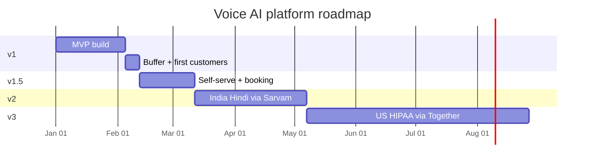

# Roadmap

Strategic roadmap for the platform. This document covers the long-term shape of the product across four major version milestones, the bets behind each, and how they connect.

See `mvp-planning.md` for v1 execution detail, `features.md` for the complete feature inventory across all versions, and `design.md` for system architecture.

---

## Contents

1. [Vision](#vision)
2. [Timeline](#timeline)
3. [v1 — MVP](#v1--mvp)
4. [v1.5 — Self-serve + booking](#v15--self-serve--booking)
5. [v2 — India Hindi + depth](#v2--india-hindi--depth)
6. [v3 — US HIPAA + enterprise](#v3--us-hipaa--enterprise)
7. [Future](#future)
8. [Themes across the roadmap](#themes-across-the-roadmap)

---

## Vision

A multi-vertical, multi-market AI voice agent platform. The same backend serves clinics, restaurants, hotels, retail, and any other small business that needs a customer-facing voice agent. Providers (STT, TTS, LLM, telephony) swap per tenant through configuration, so expanding to new languages or compliance regimes is a config change, not a rebuild.

The product is built around three convictions:

**One generic agent fits every vertical.** Vertical-specific behavior comes from the system prompt, the knowledge base, and the tool whitelist, not from separate state machines. A clinic receptionist and a hotel concierge run identical Pipecat pipelines — they differ only in configuration. This keeps the codebase small and lets the platform serve new verticals without engineering work.

**Provider abstraction is the architectural spine.** STT, TTS, and LLM all sit behind protocol interfaces. The pipeline never depends on a specific vendor. This is what makes "ship India English today, add Hindi in two months, add US HIPAA in six" possible without rewriting any code in the voice path.

**Multi-tenant from day one.** No single-tenant version exists. Tenant isolation via Postgres Row Level Security is enforced from v1 so that every later feature inherits isolation guarantees without retrofit work.

---

## Timeline

Total elapsed time from v1 kickoff to v3 launch: roughly 9 months. Each version unlocks the addressable market for the next: v1 validates the product, v1.5 validates self-serve at scale, v2 expands the Indian market by an order of magnitude, v3 opens the US market with its higher willingness-to-pay.

---

## v1 — MVP

**Window**: Weeks 1–5, with week 6 as buffer.
**Market**: India English.
**Theme**: Ship the smallest end-to-end voice agent platform that the team can operate manually for the first cohort of paying customers.

### Strategic rationale

v1 exists to prove three things in five weeks: (1) the voice pipeline works reliably on the consolidated Deepgram + DeepSeek stack, (2) tenants can be configured fast enough that one team can onboard customers profitably, and (3) the architecture genuinely extends to more markets without rewrites. Everything else is deferred.

The chosen first market is India English because the cost stack is among the cheapest globally, English is supported natively by every provider in the v1 pipeline, the home market shortens sales cycles, and Indian SMBs in metros (Delhi, Mumbai, Bangalore) have high willingness to pay for missed-call recovery and customer support automation.

The voice stack consolidates onto a single vendor for both speech layers: **Deepgram Nova-3 Monolingual for STT and Deepgram Aura-1 for TTS**. One SDK, one API key, one BAA path when the US tier comes online later. Deepgram's $200 starter credit covers the entire build phase plus initial customer testing — paid usage begins only after the first paying customer goes live.

The sales motion is fully team-driven in v1. The internal dashboard is the configuration path; the client portal is read-only. This trade-off ships the product weeks faster and gives the team direct visibility into what onboarding actually requires before locking in a self-serve UX.

### Goals

- First paying customers onboarded by the team (sales-led, manual/offline payment)
- Sub-1.2 second per-turn latency on the 90th percentile
- Per-minute COGS at or near ~$0.024 at planned usage levels (India English)
- Foundational architecture (provider abstraction, multi-tenancy, RLS) in place for later versions

### Key deliverables

Phase-by-phase breakdown is in `mvp-planning.md`. Headline items:

- Twilio + Pipecat + Deepgram (STT + TTS) + DeepSeek voice pipeline, self-hosted in FastAPI
- Multi-tenant data architecture with Row Level Security enforced
- Provider abstraction layer with one concrete implementation per role
- Internal dashboard for tenant creation, agent configuration, knowledge upload, call review, audit log
- PDF-based knowledge base with pgvector retrieval
- Three core tools: transferToHuman, sendSms, escalateToOwner
- Read-only client portal (dashboard, call logs, billing/usage)
- Sales-led onboarding: lead capture → email → manual/offline payment → time-bound access (`paid_until`); usage rollup for manual invoicing (payment gateway deferred)
- DPDP Act compliance basics (data residency, consent disclosure, data export and deletion)
- Sentry observability with PII scrubbing

### What success looks like

By the end of week 6, the team has between three and five paying customers, each running an AI agent on a real Twilio number, each taking at least ten real calls per week, with no P0 outages reported.

---

## v1.5 — Self-serve + booking

**Window**: 4 weeks after v1 buffer, weeks 7–10.
**Market**: India English (same as v1, expanded reach).
**Theme**: Reduce sales bandwidth per customer. Add the booking flows that customers ask for most.

### Strategic rationale

v1 ships fast by being sales-led, but the team's bandwidth caps the growth rate at roughly 5–10 customers per month per salesperson. v1.5 builds the self-serve wizard, informed by what the v1 customers struggled with during manual onboarding, so that new tenants can sign up without team involvement.

The second priority is booking. Most v1 customers will be clinics or restaurants where the most common ask is "let the AI book appointments." v1 ships without this — bookings get transferred to humans. v1.5 adds Google Calendar integration and the booking tool family.

### Goals

- New tenants can sign up and get to first live call in under 30 minutes without team involvement
- Google Calendar booking works end-to-end for receptionist and restaurant verticals
- Customer-acquisition rate decoupled from team headcount

### Key deliverables

- Self-serve 5-step onboarding wizard with funnel analytics
- Google Calendar OAuth and the booking tool family (`checkAvailability`, `bookAppointment`, `rescheduleAppointment`, `cancelAppointment`)
- Four additional starter prompts (receptionist, restaurant, hotel, retail) with auto-suggest by vertical
- URL scraping and manual FAQ entry for knowledge base
- Custom state machine via Pipecat Flows for explicit workflow control
- Interactive client portal — prompt editing, voice selection from the Deepgram Aura catalog, tool whitelist editing, phone number management
- Test call simulator
- PostHog product analytics, eval pipeline (daily replay), sentiment analysis per turn
- Self-serve onboarding + payment gateway (Razorpay / Cashfree, India-friendly) — replaces v1's manual onboarding + offline payment
- Annual billing, refunds, dunning (via the gateway) — no free trial; the product stays paid-only
- Krisp noise cancellation
- Help center / docs site

### What success looks like

Customer acquisition rate climbs to 20+ new tenants per month with the same team. Onboarding funnel conversion from signup to first live call exceeds 60%.

---

## v2 — India Hindi + depth

**Window**: 8 weeks after v1.5, months 3–4.
**Market**: India Hindi (in addition to English).
**Theme**: 10× addressable market in India by adding Hindi. Deepen integrations for existing English customers.

### Strategic rationale

Roughly 95% of India's small businesses operate primarily in Hindi or a regional language, not English. v1 and v1.5 capture only the English-speaking metro segment. v2 unlocks the rest of India.

The technical work is bounded: build Sarvam STT and TTS implementations of the provider protocols. The pipeline code does not change. Tenant `language` configuration drives provider selection at agent spawn.

Sarvam is chosen over Deepgram for Hindi specifically because Sarvam specializes in Indian languages and natively handles Hinglish code-switching mid-sentence — a pattern most Indian SMBs and their customers use constantly. Deepgram Nova-3 Multilingual remains an option to evaluate in pilots, but the default for Hindi tenants is Sarvam.

The depth work alongside Hindi addresses what v1 and v1.5 customers ask for after a few months: more integrations beyond Google Calendar (Calendly, Outlook, custom webhooks), Slack and WhatsApp notifications, and richer real-time visibility for the internal team.

### Goals

- Hindi (Devanagari and Hinglish code-switching) supported via Sarvam
- Custom webhook tool enables tenant-specific integrations without code changes
- Real-time call monitoring for the internal team

### Key deliverables

- `SarvamSTT` and `SarvamTTS` provider implementations
- Hindi versions of all starter prompts
- Per-tenant language configuration
- Calendly, Outlook, Slack, WhatsApp Business integrations
- Custom webhook tool for tenant-defined endpoints
- Real-time call monitoring in internal dashboard
- Team member invites in client portal
- Multi-currency billing (INR + USD)
- Provider latency comparison dashboard
- Cost anomaly detection
- Stretch: Bengali, Tamil, Marathi support (gated on demand)
- Multilingual marketing site (Hindi)
- GDPR compliance for eventual EU expansion

### What success looks like

Hindi-speaking customers represent 30%+ of new tenants by the end of v2. Average tenant call volume increases as agents handle the language their customers actually speak. Custom webhook tool adoption proves the platform's flexibility for verticals the team hasn't built specific integrations for.

---

## v3 — US HIPAA + enterprise

**Window**: 16 weeks after v2, months 5–8 (SOC 2 audit runs 3–6 months in parallel).
**Market**: US English with HIPAA eligibility (in addition to India).
**Theme**: Open the US healthcare market. Add enterprise-grade integrations and contracting.

### Strategic rationale

The US healthcare market has dramatically higher willingness-to-pay per tenant ($349+/month vs ₹2,999–7,999 in India) and a clearer ROI story (missed-call recovery for medical practices is a multi-thousand-dollar-per-month problem). The catch is that the public DeepSeek API cannot legally process PHI, every provider in the stack needs a BAA, and SOC 2 Type II takes months.

The architectural commitment from v1 — the provider abstraction layer — is what makes this version technically straightforward. Together AI offers DeepSeek with a BAA at roughly 4–6× the native API cost; we wire a new `TogetherDeepSeekLLM` provider. Twilio HIPAA and Deepgram's Enterprise BAA tier (covering both STT and TTS in a single agreement) are configuration changes per tenant.

Standardizing both voice layers on Deepgram in v1 pays off here: one BAA covers the entire voice stack instead of two separate vendor BAAs to negotiate, review, and renew.

The compliance work is the long pole: SOC 2 Type II audit takes 3–6 months and costs $20–50K, signed BAAs with every vendor in the stack must be in place before the first PHI-touching call, and the entire DPDP-compliant infrastructure must be replicated in a HIPAA-eligible US region.

### Goals

- First US HIPAA-eligible customer live and operational
- Enterprise-grade integrations available for both Indian and US customers
- Public API enabling clients to integrate platform events into their own stack

### Key deliverables

- `TogetherDeepSeekLLM` provider implementation
- `DeepgramSTTEnterprise` and `DeepgramTTSEnterprise` providers wired on Deepgram's BAA tier
- Twilio HIPAA configuration
- SOC 2 Type II audit completed
- Signed BAAs with Together AI, Twilio, Deepgram Enterprise, Supabase Pro, Render or Railway BAA tier
- Custom workflow per tenant (tenants define their own state machines)
- Vertical-specific integrations: Salesforce, HubSpot, Practo, Toast, Petpooja
- Public API for clients with API key management
- Webhook events to client systems (call.ended, call.transferred, etc.)
- White-label / reseller mode
- Number porting (BYO) as a paid service tier
- Spanish, French language support
- Per-line pricing model option
- Enterprise custom contracts via manual / gateway invoicing
- Distributed tracing (OpenTelemetry)
- Penetration testing engagement
- Granular role-based permissions

### What success looks like

First US clinic customer signed and live with a HIPAA-compliant configuration. Indian customers have access to the same depth of integrations as US ones. The platform can credibly compete for enterprise deals in both markets.

---

## Future

Reserved for features that should not be built speculatively. Each item below is gated on a paying customer explicitly demanding it AND committing to a contract that justifies the engineering cost.

The discipline here matters more than the list. The single biggest risk to a multi-vertical platform is building horizontally — adding feature after feature that "might be useful" — without proving that each one drives revenue. Everything in this section stays unbuilt until a real customer hand says they will pay for it.

- **Outbound dialing campaigns** — different compliance scope (DNC lists, TRAI regulations), reserves a different sales motion
- **Voice payments and PCI DSS** — collecting credit card info via voice expands compliance scope significantly
- **Voice cloning per client** — Deepgram Aura supports a curated voice catalog; custom cloning is an Enterprise conversation
- **IVR phone tree integration** — "Press 1 for English" flows before AI agent
- **Visual workflow editor** — drag-and-drop state machine builder, large UX investment
- **Mid-call language switching** — caller starts in one language, switches mid-conversation
- **Mobile app** — native iOS and Android, large surface area
- **Tool marketplace** — third-party developers publish tools, requires marketplace governance
- **Reseller marketplace billing** — partners bill end clients
- **Bug bounty program** — requires meaningful scale to justify

---

## Themes across the roadmap

### Provider abstraction is the spine

The architectural commitment in v1 to abstract STT, TTS, and LLM behind protocol interfaces is what makes every later version possible without a rewrite. v2 adds Sarvam by writing two new provider classes. v3 adds Together AI by writing one, and switches Deepgram to its Enterprise BAA tier via a config flag. The pipeline code does not change between v1 and v3. This is the single most important technical decision in the platform.

### One vendor for both voice layers in v1

STT and TTS both routed through Deepgram in v1 isn't a cost decision — it's a complexity decision. One SDK, one credential, one SLA to track, one BAA path for v3. The provider abstraction (above) preserves the option to swap one layer to a different vendor per-tenant if a specific customer demands it, but the default stays consolidated.

### Sales-led before self-serve

v1 is fully sales-led: the internal dashboard is the configuration path. Self-serve onboarding is deliberately deferred to v1.5 so that the first cohort of customers can shape what the wizard needs to do, instead of building the wizard against guesses. The 4-week delay shipping self-serve is a deliberate trade against guessing wrong about the onboarding flow.

### One agent, infinite verticals

Rather than building separate vertical templates as state machines, the platform ships one generic agent customized via prompt and tool whitelist. Vertical specialization lives in starter prompts and whitelisted tools, not in code. This keeps the engineering surface small as more verticals get added.

### Multi-tenant from day one

There is no single-tenant version of the platform. Tenant isolation via Postgres RLS is enforced from v1 so that every later feature inherits isolation guarantees without retrofit. Adding multi-tenancy to a single-tenant codebase later is expensive and error-prone; building it in from the start is cheap.

### Markets are configuration

India English, India Hindi, US HIPAA, and global English are all the same product with different provider configurations and starter prompts. The team picks shipping order based on market readiness and willingness-to-pay, not technical readiness. Engineering work between markets is bounded to new provider implementations and translated prompts — never pipeline rewrites.

### Compliance follows revenue, not the other way around

HIPAA is in v3 because a US clinic prospect should drive the SOC 2 audit and BAA negotiation, not the other way around. Spending $50K and 6 months on compliance speculation before there's a paying US customer wastes capital. The architecture supports HIPAA from v1 — only the operational compliance work is deferred until the revenue is concrete.

---

_End of roadmap.md_
